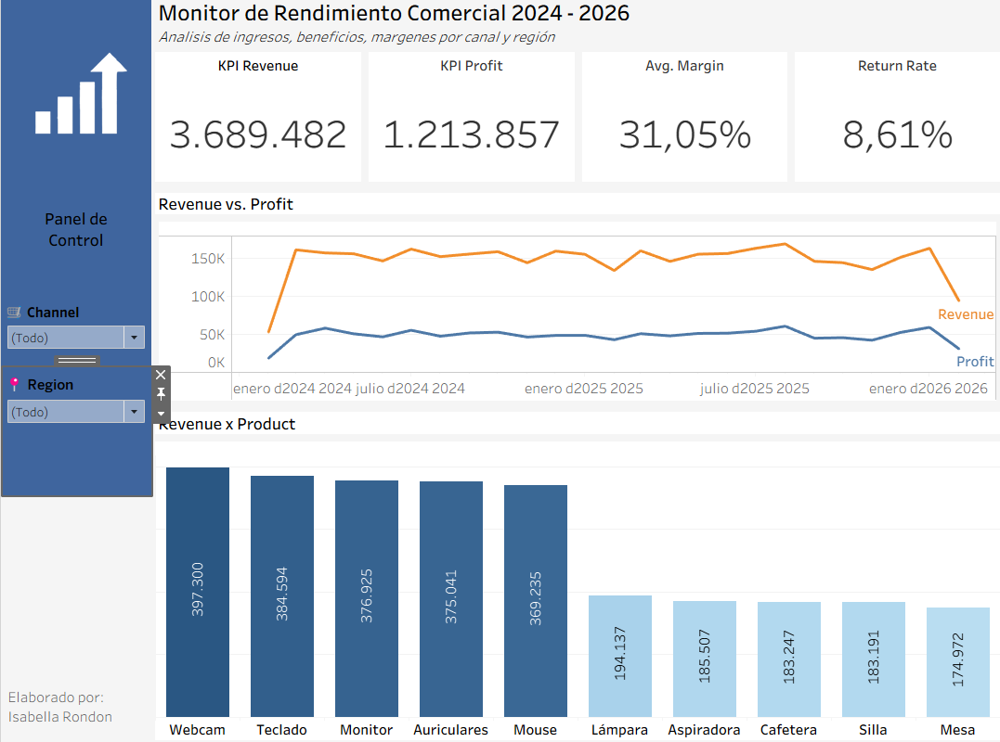
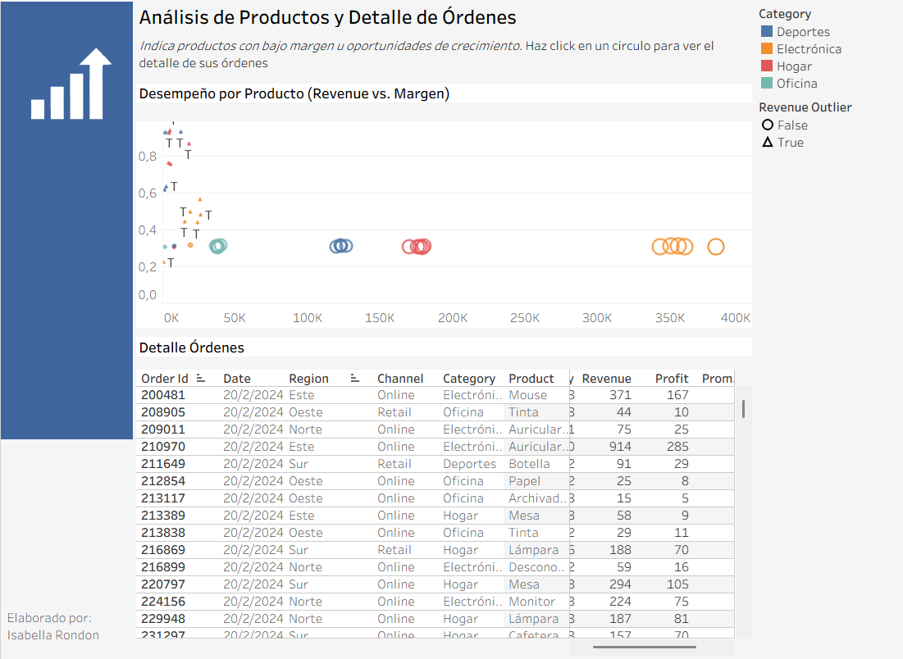

# 📊 Commercial Performance Monitor — Retail Business Analysis (2024–2026)

> **Identifying growth opportunities, margin inefficiencies, and data quality issues in a retail company's operations through business-focused data analysis.**

[](https://public.tableau.com/app/profile/isabella.rondon/viz/Dashboard-IsabellaRondon/Dashboard2)

---

## 🗂️ Project Overview

| Detail | Description |
|--------|-------------|
| **Tool** | Tableau Desktop |
| **Dataset** | `transactions_clean.xlsx` — 25,000 retail transactions |
| **Period** | January 2024 – February 2026 |
| **Scope** | Revenue, Profit, Margin, Return Rate by Product, Category, Region & Channel |

---

## 📁 Repository Structure

```
📦 retail-commercial-monitor/
├── 📊 dashboard/
│   ├── Commercial_Monitor.twbx        ← Tableau packaged workbook
│   └── screenshots/
│       ├── dashboard_1_performance_monitor.png
│       └── dashboard_2_product_analysis.png
├── 📂 data/
│   └── transactions_clean.xlsx        ← Clean dataset (25K transactions)
└── README.md
```

---

## 📌 Dashboard Previews

### Dashboard 1 — Commercial Performance Monitor
*KPIs, Revenue vs. Profit trend over time, and Revenue by Product*



**Key KPIs at a glance:**
- 💰 **Total Revenue:** $3,689,482
- 📈 **Total Profit:** $1,213,857
- 📊 **Avg. Margin:** 31.05%
- 🔄 **Return Rate:** 8.61%

---

### Dashboard 2 — Product Analysis & Order Detail
*Revenue vs. Margin scatter plot with outlier detection + interactive order table*



---

## 🔍 Business Insights

### 💡 Insight 1 — Category Dependency Risk

**Finding:** The company is heavily reliant on the Electronics category to drive the bulk of its revenue, leaving significant untapped potential in its second-strongest category: Home.

**Evidence:** The top 5 Electronics products each generate over $360K individually (Webcam leads at $397K), while the top Home product (Lamp) reaches only $194K — a gap of more than 50%. In the scatter plot, the Electronics cluster dominates the right side of the revenue axis with a standard ~30% margin.

**Recommendation:** Implement a **cross-selling strategy** by bundling Electronics best-sellers (e.g., Monitor, Webcam) with high-potential Home products (e.g., Lamp, Desk Chair). This would accelerate Home category growth without requiring new inventory investment.

---

### 💡 Insight 2 — High-Margin, Low-Volume Opportunity ⭐ *Priority Action*

**Finding:** Several products in the portfolio offer exceptionally high margins (≥80%) but are currently generating near-zero sales volume — representing the most immediate opportunity to boost net profit.

**Evidence:** In the scatter plot (Dashboard 2), points labeled **"T" (Revenue Outliers)** cluster in the upper-left quadrant: margins above 80% with revenue between $0–$20K. These products are virtually invisible to the business today.

**Recommendation:** This is the **highest-priority action**. Two levers to activate:
1. **Targeted marketing campaigns** focused specifically on these high-margin SKUs
2. **Commission incentive restructuring** — reward sales teams more aggressively for selling these products

Since these items already exist in inventory, any increase in sales volume translates *directly* into net profit with no additional cost burden. This is the fastest path to injecting liquidity and maximizing short-term profitability.

---

### 💡 Insight 3 — Data Quality: Unknown Product Registrations

**Finding:** A segment of transactions is categorized under an **"Unknown"** product label, creating a blind spot in performance analysis and preventing accurate SKU-level tracking.

**Evidence:** Both the order detail table and the scatter plot show transactions with 20–30% margins registered under "Unknown" — indicating these products were not correctly mapped in the system at the point of entry.

**Recommendation:** Conduct a cross-functional **data audit** between the Sales and Operations teams to reconcile these SKUs. Correcting the mapping will unlock cleaner reporting and may reveal additional revenue from currently unattributed products.

---

## 🧠 Strategic Decision Framework

| Priority | Insight | Timeline | Expected Impact |
|----------|---------|----------|----------------|
| 🥇 **#1** | Push high-margin products (≥80%) via campaigns + incentives | Short-term | Immediate profit boost |
| 🥈 **#2** | Cross-sell Electronics + Home bundles | Medium-term | Revenue diversification |
| 🥉 **#3** | Audit and fix "Unknown" SKU registrations | Short-term | Data integrity & visibility |

---

## 🛠️ Tools & Skills Applied

- **Tableau Desktop** — Dashboard design, scatter plots, time series, KPI cards, interactive filters
- **Excel / Power Query** — Data cleaning and preparation (25K rows)
- **Business Analysis** — Margin analysis, outlier detection, cross-selling strategy, revenue decomposition
- **Data Storytelling** — Translating visual patterns into prioritized, actionable business recommendations

---

## 👩🏼‍💻 About the Author

**Isabella Rondón** — Business Intelligence & Data Analyst | Economist

[](https://www.linkedin.com/in/isabella-rondon-rojas-/)
[](https://github.com/iarondon3)

*Passionate about turning complex datasets into strategic decisions that make businesses more competitive.*
